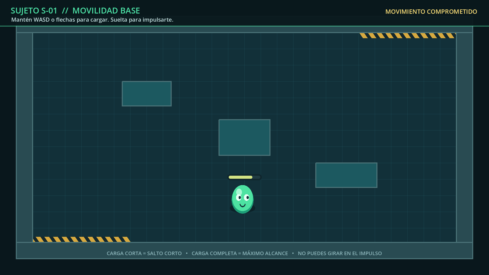

# Prototipo aislado: movimiento cargado del slime

Proyecto Godot 4 independiente para probar la movilidad base del slime antes de
asimilar piernas humanas.

Todo el prototipo vive dentro de `prototypes/slime_charge_movement/`. No modifica
las escenas, scripts ni la configuración de `prueba_2`.



## Estado actual

- Resolución lógica: **1920 × 1080**.
- Movimiento cenital en ocho direcciones.
- Carga mediante `WASD` o flechas.
- Barra de potencia situada sobre el slime.
- Lanzamiento comprometido, sin corrección durante el recorrido.
- Colisiones con paredes y obstáculos.
- Deformación visual independiente de la colisión.
- Habitación de laboratorio generada sin recursos gráficos externos.
- Pruebas headless incluidas.

## Cómo ejecutarlo

Desde la raíz del repositorio:

```powershell
godot --path prototypes/slime_charge_movement
```

Si el alias de Winget todavía no está disponible en la terminal actual:

```powershell
& "$env:LOCALAPPDATA\Microsoft\WinGet\Packages\GodotEngine.GodotEngine_Microsoft.Winget.Source_8wekyb3d8bbwe\Godot_v4.7.1-stable_win64.exe" `
  --path prototypes/slime_charge_movement
```

Godot abrirá directamente `scenes/main.tscn`.

## Controles

| Acción | Entrada |
|---|---|
| Elegir dirección y cargar | Mantener `WASD` o flechas |
| Corregir dirección | Cambiar las teclas mientras se carga |
| Liberar el impulso | Soltar todas las direcciones |

La barra cambia de verde a amarillo. Cuando alcanza el máximo, realiza un pulso
visual.

## Flujo del movimiento

```text
REPOSO → CARGA → IMPULSO → RECUPERACIÓN → REPOSO
```

### Reposo

El slime espera una entrada direccional.

### Carga

La dirección puede corregirse y la potencia aumenta durante un máximo de un
segundo. Las entradas diagonales se normalizan.

### Impulso

Al soltar las teclas, el slime avanza a velocidad constante. La distancia depende
de la potencia. No se puede girar ni cancelar.

### Recuperación

Una pausa de `0.12 s` separa un recorrido del siguiente. Una colisión produce un
aplastamiento más marcado.

## Valores de diseño

La fuente única de estos valores es `scripts/charge_motion.gd`:

| Propiedad | Valor |
|---|---:|
| Carga máxima | `1.0 s` |
| Distancia mínima | `112 px` |
| Distancia máxima | `520 px` |
| Velocidad | `1040 px/s` |
| Recuperación | `0.12 s` |
| Radio de colisión | `44 px` |

Una carga del 50 % recorre `316 px`.

## Estructura

```text
slime_charge_movement/
├── project.godot
├── README.md
├── artifacts/
│   └── slime_charge_preview.png
├── docs/
│   ├── DASH_DEFINITION.md
│   └── IMPLEMENTATION_PLAN.md
├── scenes/
│   ├── main.tscn
│   └── player.tscn
├── scripts/
│   ├── arena.gd
│   ├── charge_bar.gd
│   ├── charge_motion.gd
│   ├── player.gd
│   └── slime_visual.gd
└── tests/
    ├── capture_preview.gd
    └── run_tests.gd
```

### Responsabilidades

- `charge_motion.gd`: contrato numérico y fórmulas puras.
- `player.gd`: entrada, estados, física y colisiones.
- `charge_bar.gd`: visualización de la potencia.
- `slime_visual.gd`: cuerpo procedural y squash/stretch.
- `arena.gd`: fondo, paredes y obstáculos de la prueba.
- `run_tests.gd`: verificaciones automatizadas sin dependencias externas.

## Definición para integración

La especificación aislada para el compañero está en
`docs/DASH_DEFINITION.md`.

Ese documento distingue expresamente:

- El **impulso cargado** de este prototipo: movimiento base y comprometido.
- El **DASH** actual de `prueba_2`: habilidad del boss, invulnerable y capaz de
  cruzar huecos.

No deben mezclarse las reglas de invulnerabilidad, cooldown o máscara de huecos
del DASH existente con este movimiento base.

## Pruebas

```powershell
godot --headless `
  --path prototypes/slime_charge_movement `
  --script res://tests/run_tests.gd
```

Salida esperada:

```text
PASS: all slime movement tests
```

Las pruebas cubren:

- Normalización y límite de la carga.
- Distancias mínima, media y máxima.
- Normalización diagonal.
- Transición de carga a impulso.
- Exposición centralizada de los valores de diseño.
- Comportamiento básico de la barra.
- Carga de la escena principal y sus componentes.

## Godot MCP

El servidor global de Codex quedó configurado en este equipo con:

```powershell
$godotExecutable = (Get-Command godot).Source
codex mcp add godot `
  --env "GODOT_PATH=$godotExecutable" `
  --env DEBUG=true `
  -- npx -y @coding-solo/godot-mcp
```

Comprobación:

```powershell
codex mcp get godot
```

Codex debe reiniciarse para que una tarea nueva pueda cargar las herramientas del
servidor. La sesión que realizó la instalación no puede incorporarlas en caliente.

## Evolución con piernas humanas

La siguiente iteración tendrá dos modos:

```gdscript
enum MobilityMode {
	CHARGED_BASE,
	LEGS_CONTINUOUS,
}
```

`CHARGED_BASE` conserva esta mecánica. `LEGS_CONTINUOUS` añadirá movimiento con
aceleración y frenado. El DASH especial ganado al derrotar al boss puede seguir
existiendo de manera independiente.
