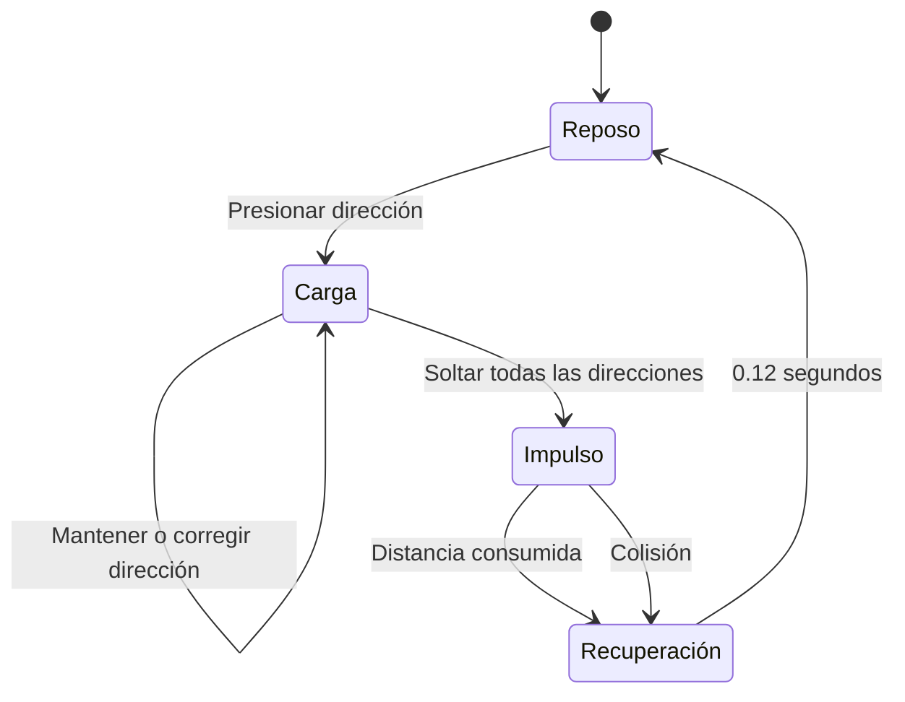

# Definición aislada del impulso cargado

Este documento define la movilidad del **slime base** desarrollada en
`prototypes/slime_charge_movement/`. Está dirigido al compañero que trabaja en
las escenas y el controlador principal.

## 1. Distinción de nombres

En el repositorio existen dos mecánicas diferentes:

| Mecánica | Ubicación | Propósito |
|---|---|---|
| **Impulso cargado** | `prototypes/slime_charge_movement/` | Movimiento base del slime antes de obtener piernas |
| **DASH de habilidad** | `prueba_2/scripts/player/slime.gd` | Recompensa del boss para cruzar huecos |

Para evitar confusiones:

- En diseño y UI, esta propuesta se llama **impulso cargado**.
- El nombre **DASH** sin calificativo se reserva para la habilidad actual de
  `prueba_2`.
- El prototipo no modifica `prueba_2`, sus escenas ni su dash.

## 2. Fantasía y costo jugable

El slime todavía no tiene piernas. No camina continuamente: acumula energía,
elige una dirección y se lanza. El beneficio es recorrer una distancia grande;
el costo es comprometerse con la trayectoria.

Con piernas humanas, una iteración posterior reemplazará este control por
movimiento continuo y preciso.

## 3. Contrato de control

1. El jugador mantiene `WASD` o las flechas.
2. La carga comienza inmediatamente.
3. La dirección puede corregirse mientras se mantienen las teclas.
4. Una barra sobre el slime representa la potencia acumulada.
5. Al soltar todas las direcciones, se inicia el impulso.
6. Durante el impulso no se puede girar, cancelar ni iniciar otra carga.
7. El impulso termina al consumir su distancia o al chocar con una pared.
8. Después existe una recuperación breve antes de aceptar otra carga.

Si se mantienen dos direcciones opuestas, la dirección resultante es cero: la
carga se pausa y conserva la última dirección válida. Soltar todas las teclas sí
libera el impulso.

## 4. Máquina de estados



Los identificadores de código están en
`scripts/player.gd`:

```gdscript
enum MovementState {
	IDLE,
	CHARGING,
	LAUNCHING,
	RECOVERING,
}
```

## 5. Definición numérica a 1920 × 1080

La fuente única de estos valores es
`scripts/charge_motion.gd`.

| Constante | Valor | Significado |
|---|---:|---|
| `MAX_CHARGE_TIME` | `1.0 s` | Tiempo requerido para llenar la barra |
| `MINIMUM_DISTANCE` | `112 px` | Distancia de una pulsación corta |
| `MAXIMUM_DISTANCE` | `520 px` | Distancia con carga completa |
| `LAUNCH_SPEED` | `1040 px/s` | Velocidad constante del recorrido |
| `RECOVERY_TIME` | `0.12 s` | Pausa posterior al recorrido |

La potencia se normaliza:

```text
potencia = clamp(tiempo_de_carga / 1.0, 0.0, 1.0)
```

La distancia usa interpolación lineal:

```text
distancia = lerp(112, 520, potencia)
```

La velocidad no cambia con la potencia. Una carga mayor produce un recorrido
más largo:

- Carga mínima: aproximadamente `0.108 s` de recorrido.
- Media carga: `316 px`, aproximadamente `0.304 s`.
- Carga máxima: `520 px`, exactamente `0.5 s`.

La entrada diagonal se normaliza, por lo que no obtiene más velocidad ni
distancia.

## 6. Colisiones

- El jugador es un `CharacterBody2D`.
- La colisión es un círculo fijo de radio `44 px`.
- El avance usa `move_and_collide()`.
- Una pared termina el impulso inmediatamente.
- El aplastamiento y estiramiento ocurren únicamente en el nodo visual.
- Este impulso no concede invulnerabilidad.
- Este impulso no desactiva capas ni permite atravesar huecos.

La última regla es importante: cruzar huecos sigue siendo responsabilidad del
DASH de habilidad existente.

## 7. Barra y respuesta visual

La barra:

- Aparece solamente en `CHARGING`.
- Se llena de izquierda a derecha.
- Cambia de verde a amarillo.
- Pulsa al llegar al máximo.
- Se oculta al liberar el impulso.

El slime:

- Se comprime durante la carga.
- Se desplaza visualmente en sentido contrario a la dirección elegida.
- Se estira durante el recorrido.
- Se aplasta con mayor intensidad al chocar.
- Nunca cambia la forma de colisión.

## 8. Diferencia frente al DASH de `prueba_2`

| Aspecto | Impulso cargado | DASH actual |
|---|---|---|
| Activación | Mantener y soltar dirección | `Shift` o `Espacio` |
| Disponibilidad | Movimiento base | Requiere `GameState.has_ability("dash")` |
| Velocidad | `1040 px/s` | `1200 px/s` |
| Duración | Depende de la carga, `~0.108–0.5 s` | Fija, `0.22 s` |
| Cooldown | No | `0.8 s` más la duración |
| Dirección | Se elige durante la carga | Última dirección `_facing` |
| Control durante el recorrido | Ninguno | Ninguno |
| Invulnerabilidad | No | Sí |
| Cruza huecos | No | Sí, desactiva temporalmente el bit 3 |
| Función narrativa | Cuerpo sin piernas | Habilidad obtenida del boss |

No se debe copiar `_start_dash()` del controlador principal para implementar el
impulso cargado: sus reglas de habilidad, invulnerabilidad y máscara de huecos
son deliberadamente diferentes.

## 9. Archivos que forman el contrato

| Archivo | Responsabilidad |
|---|---|
| `scripts/charge_motion.gd` | Constantes, normalización y distancia |
| `scripts/player.gd` | Estados, entrada, movimiento y colisión |
| `scripts/charge_bar.gd` | Representación de la potencia |
| `scripts/slime_visual.gd` | Deformación sin alterar la física |
| `scenes/player.tscn` | Ensamblaje físico y visual |
| `tests/run_tests.gd` | Contrato automatizado |

Las funciones públicas relevantes son:

```gdscript
begin_charge(direction: Vector2) -> void
update_charge(direction: Vector2, delta: float) -> void
release_charge() -> void
get_charge_power() -> float
```

## 10. Integración futura con piernas

La integración recomendada es mantener dos modos de movilidad:

```gdscript
enum MobilityMode {
	CHARGED_BASE,
	LEGS_CONTINUOUS,
}
```

- `CHARGED_BASE` usa la máquina de estados de este documento.
- `LEGS_CONTINUOUS` usa aceleración, frenado y `move_and_slide()`.
- El DASH ganado en el boss permanece como una habilidad independiente.

Esto conserva tres identidades distintas:

1. Slime sin piernas: impulso cargado y comprometido.
2. Slime con piernas: movimiento continuo.
3. Slime con habilidad DASH: ráfaga especial que cruza huecos.

## 11. Verificación

Desde la raíz del repositorio:

```powershell
godot --headless `
  --path prototypes/slime_charge_movement `
  --script res://tests/run_tests.gd
```

La salida correcta es:

```text
PASS: all slime movement tests
```

Antes de integrar en `prueba_2`, deben conservarse estas condiciones:

- La carga máxima tarda `1.0 s`.
- La media carga recorre `316 px`.
- Las diagonales están normalizadas.
- No existe giro durante `LAUNCHING`.
- Las paredes terminan el recorrido.
- La deformación no modifica la colisión.
- El impulso cargado no concede invulnerabilidad ni atraviesa huecos.
